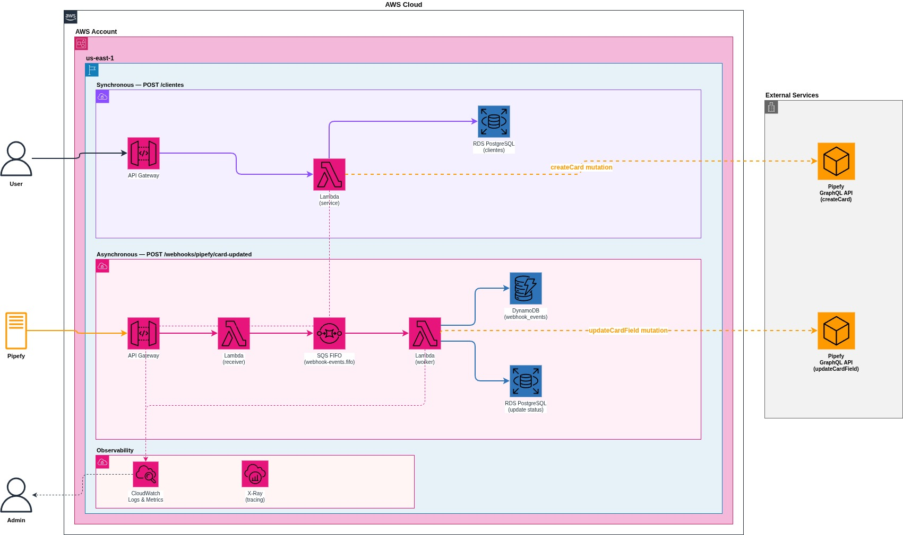

# Mundo Invest API

API interna para gerenciamento de clientes e seus patrimônios investidos, com mapeamento simulado de operações para o Pipefy via GraphQL.

## Pré-requisitos

- Python 3.11+
- Docker e Docker Compose

---

## Configuração

```bash
cp .env.example .env
```

Edite o `.env` conforme necessário. Variáveis disponíveis:

| Variável | Descrição |
|---|---|
| `ENV` | Ambiente: `local` ou `prod` |
| `DATABASE_URL` | URL de conexão com o banco (asyncpg para PostgreSQL, aiosqlite para SQLite) |
| `PIPEFY_PIPE_ID` | ID do pipe no Pipefy onde os cards serão criados |
| `PIPEFY_FIELD_ID_NOME_CLIENTE` | `field_id` do campo Nome do Cliente no pipe |
| `PIPEFY_FIELD_ID_EMAIL_CLIENTE` | `field_id` do campo E-mail do Cliente no pipe |
| `PIPEFY_FIELD_ID_TIPO_SOLICITACAO` | `field_id` do campo Tipo de Solicitação no pipe |
| `PIPEFY_FIELD_ID_VALOR_PATRIMONIO` | `field_id` do campo Valor do Patrimônio no pipe |
| `PIPEFY_FIELD_ID_STATUS` | `field_id` do campo Status no pipe |
| `PIPEFY_FIELD_ID_PRIORIDADE` | `field_id` do campo Prioridade no pipe |
| `API_KEY` | Chave de autenticação exigida no header `X-API-Key` |

---

## Execução local

### Com Docker (PostgreSQL)

```bash
docker compose up --build
```

A API estará disponível em `http://localhost:8000`.
A documentação estará em `http://localhost:8000/docs`.

### Sem Docker (SQLite)

```bash
python -m venv .venv
source .venv/bin/activate
pip install -e ".[dev]"

# Ajuste o DATABASE_URL no .env para SQLite:
# DATABASE_URL=sqlite+aiosqlite:///./mundoinvest.db

uvicorn app.main:app --reload
```


---

## Testes

Os testes usam banco SQLite in-memory.

```bash
# Instalar dependências de desenvolvimento
pip install -e ".[dev]"

# Rodar todos os testes
pytest

# Rodar com verbose
pytest -v

# Rodar arquivo específico
pytest tests/test_clientes.py -v
pytest tests/test_webhooks.py -v
pytest tests/test_pipefy_client.py -v
```

---

## Endpoints

Todos os endpoints exigem o header `X-API-Key`.

### POST /clientes

Cria um novo cliente e simula o envio de um card ao Pipefy.

```bash
curl -X POST http://localhost:8000/clientes \
  -H "Content-Type: application/json" \
  -H "X-API-Key: 76106710fcc3680c23a50adbef5096b843fb7755a77a85b8f2ea9e85f964e86a" \
  -d '{
    "cliente_nome": "João Silva",
    "cliente_email": "joao.silva@example.com",
    "tipo_solicitacao": "Atualização cadastral",
    "valor_patrimonio": 250000
  }'
```

**Response 201:**
```json
{
  "data": {
    "createCard": {
      "card": {
        "id": "972452911"
      }
    }
  }
}
```

**Response 409 — e-mail já cadastrado:**
```json
{
  "detail": {
    "error": "conflict",
    "message": "Cliente com e-mail 'joao.silva@example.com' já está cadastrado"
  }
}
```

---

### POST /webhooks/pipefy/card-updated

Simula o recebimento de um webhook do Pipefy quando um card é atualizado. Substitua card_id por um id valido.

```bash
curl -X POST http://localhost:8000/webhooks/pipefy/card-updated \
  -H "Content-Type: application/json" \
  -H "X-API-Key: 76106710fcc3680c23a50adbef5096b843fb7755a77a85b8f2ea9e85f964e86a" \
  -d '{
    "event_id": "evt_123",
    "card_id": "972452911",
    "cliente_email": "joao.silva@example.com",
    "timestamp": "2026-05-25T12:00:00Z"
  }'
```

**Response 200:**
```json
{
  "data": {
    "updateFieldsValues": {
      "success": true
    }
  }
}
```

**Response 409 — evento duplicado:**
```json
{
  "detail": {
    "error": "conflict",
    "message": "Evento 'evt_123' já foi processado"
  }
}
```

**Response 404 — cliente não encontrado:**
```json
{
  "detail": {
    "error": "not_found",
    "message": "Cliente com e-mail 'joaosilva@example.com' não encontrado"
  }
}
```

**Response 404 — card_id invalido para o cliente:**
```json
{
  "detail": {
    "error": "not_found",
    "message": "Card '580893721' não encontrado para o cliente 'joao.silva@example.com'"
  }
}
```

---


# Arquitetura e Escalabilidade na AWS

Hoje a aplicação funciona em um modelo tradicional:

```text
Request -> FastAPI -> Service -> PostgreSQL
```

Isso atende bem em baixo volume, mas existe um gargalo claro: toda a carga depende da capacidade de uma única instância da API e do banco. Conforme aumenta concorrência, o processo começa a disputar CPU, memória e conexões de banco simultaneamente.

A arquitetura foi pensada para remover esses pontos de saturação sem alterar regra de negócio.

---

## API Gateway + Lambda

O principal problema de escalar uma API tradicional é que normalmente existe uma quantidade fixa de servidores atendendo requests. Se entra mais tráfego do que o esperado, começa fila, timeout e degradação.

Com Lambda, cada request pode ser processado de forma isolada em uma execução independente. O ganho aqui é desacoplar a aplicação da limitação de um servidor único. Se o tráfego aumenta repentinamente, a AWS cria novas execuções paralelas automaticamente. 

---

## SQS no webhook

Webhook é naturalmente sensível a pico porque depende de sistemas externos. O Pipefy, por exemplo, espera resposta rápida. Se o processamento demora, ele entende como falha e dispara retry. 

O erro comum é processar tudo de forma síncrona no endpoint HTTP. Nesse caso, o endpoint pode ser separado do processamento real. A entrada apenas valida e publica a mensagem na fila. O processamento pesado acontece depois, de forma assíncrona. Isso resolve o problema de absorção de pico.

---

## SQS FIFO e idempotência

Outro problema comum em webhook é duplicidade.

Sistemas externos frequentemente reenviam eventos por timeout, retry automático ou falha de rede. Se não existir controle, o mesmo evento pode atualizar dados múltiplas vezes.

A fila FIFO ajuda a manter consistência de ordem, mas o principal controle está no `event_id`.

Antes de processar, a aplicação pode verificar se aquele evento já foi executado. Se já existir registro, ignora.

Isso torna o processamento idempotente, evitando:

* gravação duplicada
* alteração repetida de status
* inconsistência de dados

---

## RDS PostgreSQL

O banco normalmente vira o principal gargalo conforme aumenta concorrência.

Além do volume de dados temos os seguintes problemas:

* quantidade de conexões simultâneas
* contenção de escrita
* disponibilidade
* failover

O RDS resolve principalmente a parte operacional do PostgreSQL. O banco passa a ter:

* backup automatizado
* monitoramento
* failover com Multi-AZ
* manutenção gerenciada

Em caso de falha da instância principal, o RDS promove automaticamente a réplica de outra zona de disponibilidade.

---

## DynamoDB para webhook_events

A tabela de eventos possui um padrão simples:

* gravação por chave
* consulta direta por chave

Não existe relacionamento complexo nem necessidade relacional forte.

Em um banco relacional, isso funciona, mas gera uso desnecessário de conexão e recurso para uma operação muito simples.

O DynamoDB resolve esse tipo de acesso com baixa latência e alta taxa de escrita. Na prática, ele tira carga desnecessária do PostgreSQL para um caso de uso que é basicamente key-value.

---

## Arquitetura POC



## Deploy real AWS
Eu repliquei parte dessa arquitetura proposta na AWS com API Gateway + ECR + Lambda + RDS. Hoje a API está acessivel em: 

https://1gy0f858nl.execute-api.us-east-1.amazonaws.com/
e
https://1gy0f858nl.execute-api.us-east-1.amazonaws.com/docs

## Endpoints

### POST /clientes

```bash
curl -X POST https://1gy0f858nl.execute-api.us-east-1.amazonaws.com/clientes \
  -H "Content-Type: application/json" \
  -d '{
    "cliente_nome": "João Silva",
    "cliente_email": "joao.silva@example.com",
    "tipo_solicitacao": "Atualização cadastral",
    "valor_patrimonio": 250000
  }'
```

### POST /webhooks/pipefy/card-updated
```bash
curl -X POST https://1gy0f858nl.execute-api.us-east-1.amazonaws.com/webhooks/pipefy/card-updated \
  -H "Content-Type: application/json" \
  -d '{
    "event_id": "evt_123",
    "card_id": "972452911",
    "cliente_email": "joao.silva@example.com",
    "timestamp": "2026-05-25T12:00:00Z"
  }'

```